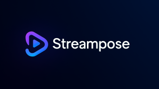
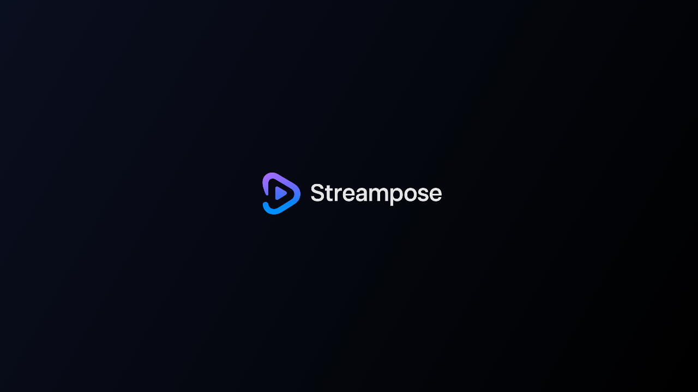
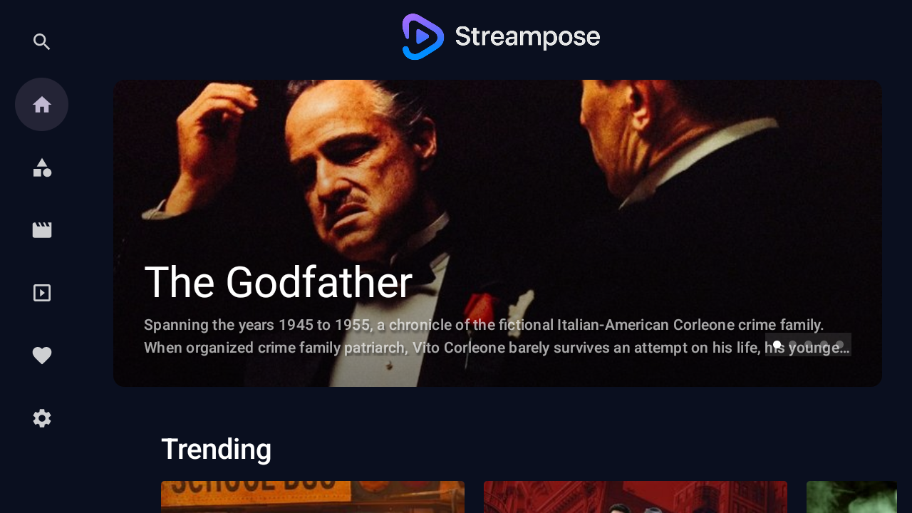
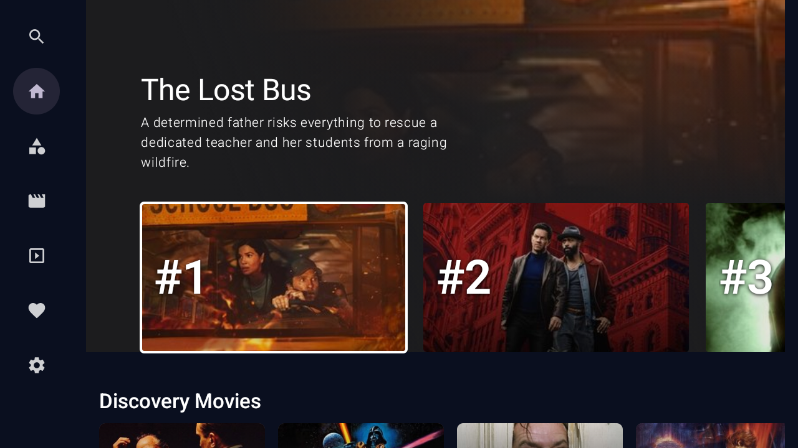
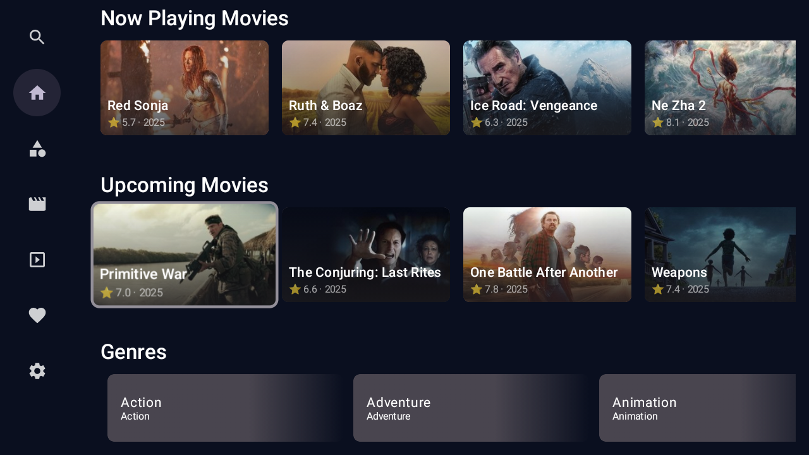
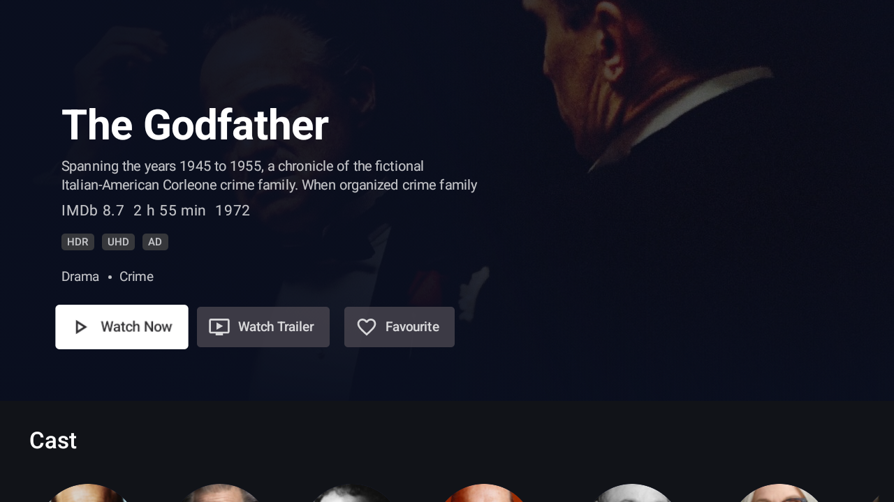
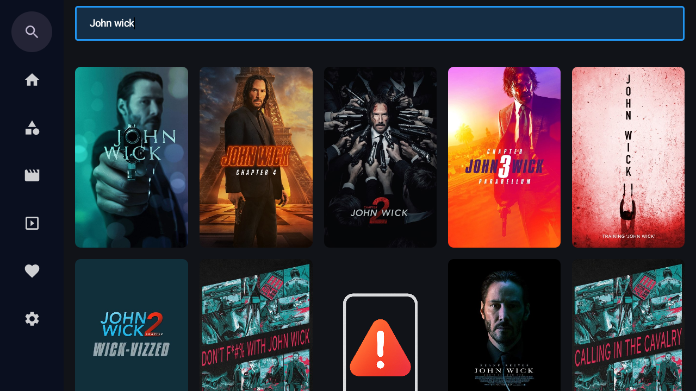
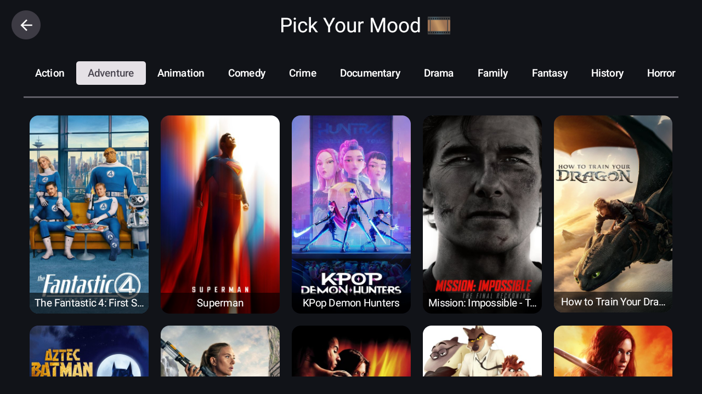
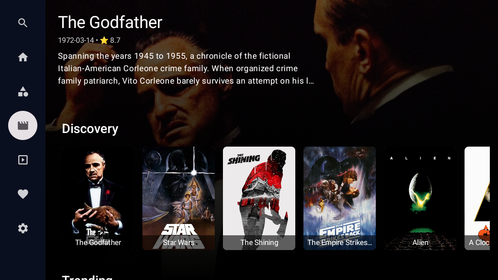
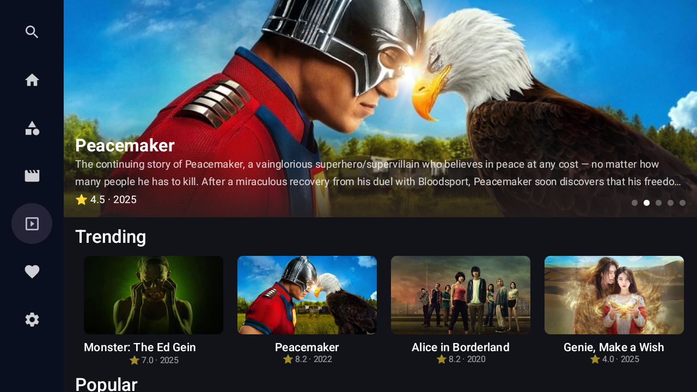

<p align="center">
  
</p>

<h1 align="center">📺 Streampose - Your TV, Your Stream</h1>

<p align="center">
  Modern Android TV Streaming App built with Jetpack Compose
</p>

Streampose is a modern **Android TV streaming application** built using **Jetpack Compose for TV**.  
It demonstrates a clean architecture, scalable codebase, and smooth user experience optimized for large screens.

---

## ✨ Features

- 📺 Android TV optimized UI
- 🎬 Movie & TV browsing (TMDB API)
- ⚡ Built entirely with Jetpack Compose (TV)
- 🧭 D-pad navigation support
- 🔄 Infinite scrolling with Paging 3
- 💾 Local caching using Room Database
- 🎨 Modern Material UI
- ⚙️ Scalable MVVM architecture

---

## 🛠️ Tech Stack

- Jetpack Compose TV  
- MVVM Architecture  
- Hilt (Dependency Injection)  
- Kotlin Flow  
- Room Database  
- DataStore (Preferences)  
- Paging 3  
- TMDB API  
- Coil (Image Loading)  
- Retrofit (API Calls)  
- GSON (JSON Parsing)  
- Navigation Compose  
- TV Foundation  

---
## 🔗 Demo Video

📺 **Watch demo on YouTube**

[](https://www.youtube.com/watch?v=cwOJU2mkdCQ)  
➡️ *Click the thumbnail to play demo video*

---
## 📸 Screenshots

|  |  |  |
|--------------------|--------------------|--------------------|
|  |  |  |
|  |  |  |

---


## 🚀 Getting Started

### 1. Clone the Repository
```bash
git clone https://github.com/Dinesh2510/Streampose-Jetpack-Compose-Android-TV-Streaming-App.git
cd Streampose-Jetpack-Compose-Android-TV-Streaming-App
```

### 2. 🔑 TMDB API Setup
To fetch real movie and TV show data, you need an API key from [The Movie Database (TMDB)](https://www.themoviedb.org/).

1. Create an account on TMDB.
2. Go to your settings and generate an **API Key**.
3. Create or open your `local.properties` file in the project root.
4. Add your key:
   ```properties
   TMDB_API_KEY="your_api_key_here"
   ```

---

## 📂 Project Structure
```text
com.pixeldev.composetv/
├── data/           # Data layer (API, Database, Repositories)
├── di/             # Hilt Dependency Injection modules
├── graph/          # Compose Navigation Graph
├── models/         # Data Models / DTOs
├── screens/        # UI Screens (Compose TV components)
├── ui.theme/       # Theme, Colors, and Typography
├── utils/          # Helper classes & Extensions
├── MainActivity    # Entry Activity
└── MyApp           # Application Class
```

---

## 🤝 Contributing
We welcome contributions! To contribute:

1. **Fork** the repository.
2. **Clone** your fork:
   ```bash
   git clone https://github.com/Dinesh2510/Streampose-Jetpack-Compose-Android-TV-Streaming-App.git
   ```
3. **Create** a feature branch: `git checkout -b feature/your-feature`.
4. **Commit** your changes: `git commit -m "feat: description"`.
5. **Push** to the branch: `git push origin feature/your-feature`.
6. **Open** a Pull Request.

---

## 📄 License
This project is licensed under the **MIT License**. See the `LICENSE` file for details.

---

## 👨‍💻 Author
* GitHub: [@Dinesh2510](https://github.com/Dinesh2510)

---

⭐ *If you found this project helpful, please give it a star!* 🌟

---

